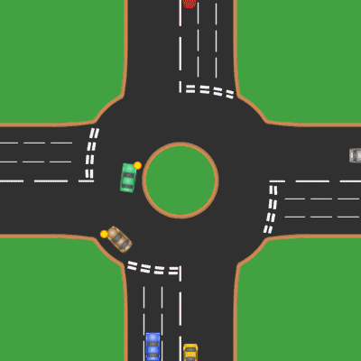

# BRANCH DE TRABAJO PARA ENTREGA FINAL

# Movilidad-Urbana-MSMGC-GPO-302

### Integrantes

- Sergio Manuel Gonzalez Vargas - A01745446
- Gilberto André García Gaytán - A01753176
- Fernando Ortiz Saldaña - A01376737
- Ricardo Ramírez Condado - A01379299

### Liga de Archivos en Google Drive

#### <a href="https://drive.google.com/drive/folders/1z2ETYn4h0Xb2oYKgaC0iAb2sPr4sbUAe?usp=sharing"> Carpeta de Documentos </a>

### Contenido del Proyecto

#### Documentacion

- `<a href="https://github.com/SergioGonzalez24/Movilidad-Urbana-MSMGC-GPO-302/blob/main/Documentacion/Entregas%20Individuales/Revision%201.pdf">` Revision 1 `</a>`
- `<a href="https://github.com/SergioGonzalez24/Movilidad-Urbana-MSMGC-GPO-302/blob/main/Documentacion/Entregas%20Individuales/Revision%202.pdf">` Revision 2 `</a>`
- `<a href="https://github.com/SergioGonzalez24/Movilidad-Urbana-MSMGC-GPO-302/blob/main/Documentacion/Entregas%20Individuales/Revision%203.pdf">` Revision 3 `</a>`

### Actividad Integradora

- `<a href="https://github.com/SergioGonzalez24/Movilidad-Urbana-MSMGC-GPO-302/tree/main/ActividadIntegradora">` Actividad Integradora `</a>`

### Problematica

Proponer una solución al problema de movilidad urbana en México, mediante un enfoque que reduzca la congestión vehicular al simular de manera gráfica el tráfico, representando la salida de un sistema multi agentes.
